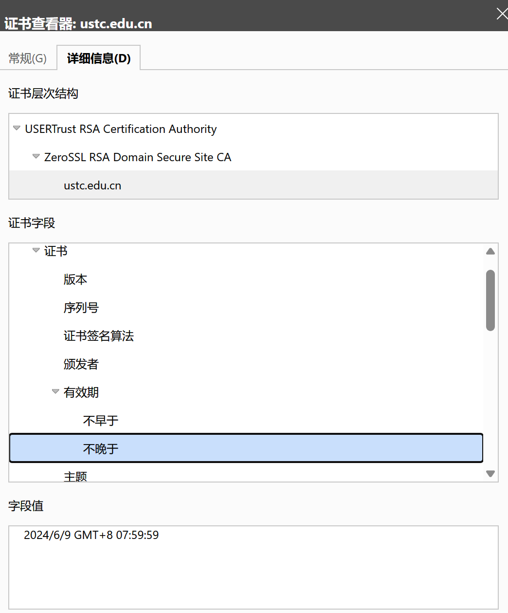
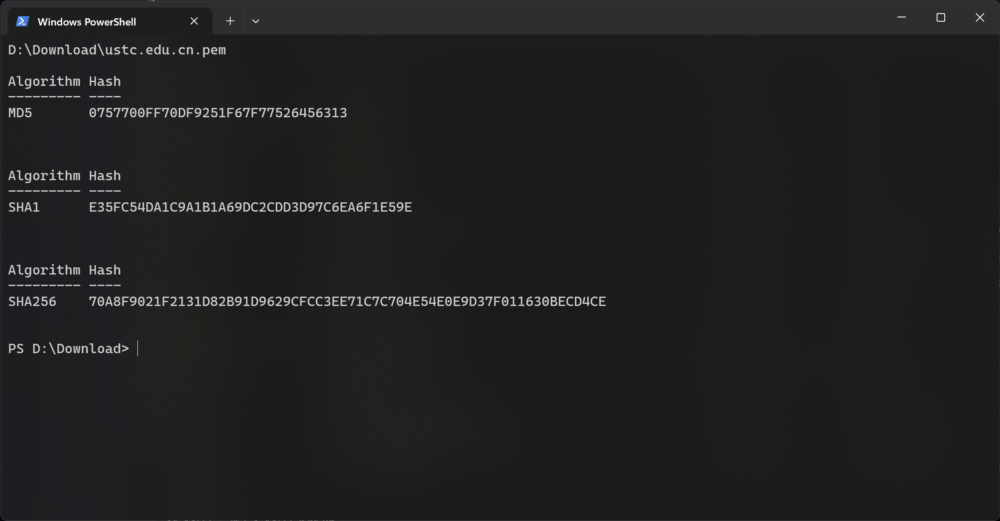

# Lab 1

## 1 (5 points)

> What are the risks of having the US government select a cryptosystem for widespread commercial use (both inside and outside the United States). How could users from outside the United States overcome some or all of these risks

选择密码系统时存在的风险：
- **单点失败风险**：广泛使用同一个密码系统可能导致单点失败的风险，一旦该系统被破解，所有依赖该系统的安全措施都会受到影响。
- **信任问题**：如果密码系统是由某一国家政府选择的，那么其他国家可能会对这个系统的安全性和公正性持怀疑态度。他们可能担心该系统内置了后门或者存在偏见。

克服这些风险的方法：
- **采用多种密码技术**：不完全依赖单一的密码系统，而是结合使用多种技术，以减少依赖特定系统的风险。
- **开源和透明**：选择那些公开审计、代码开源的密码系统，以便全球社区可以检查其安全性。
- **国际标准**：参与或采用国际加密标准而不是特定国家的标准，这有助于提高跨国界的信任度。


## 2 (5 points)

> Why do we need modes of operation for block ciphers? Also, Give a direct comparison between CBC and CTR.

$\qquad$区块密码的操作模式是必要的，因为它们能够提供比单纯的区块加密更加丰富和安全的功能，可以确保加密的唯一性和数据的完整性。<br/>
$\qquad$在CBC模式中，每个明文块在加密之前都会与前一个密文块进行异或操作（第一个密文快与初始化向量IV异或）；加密不可以并行，加密速度相对较慢，解密可以并行；是IND-CPA安全的，前提是初始化向量IV随机；需要在末尾加padding。<br/>
$\qquad$而CTR模式将明文块与加密结果进行异或操作来加密数据，选择随机生成的Nonce (number used once) + 递增的Counter 作为加密的输入；加密解密均可并行；是IND-CPA安全的，要求Nonce随机生成，并且不能重复使用；不需要padding。

## 3 (20 points)

> Explain why hash collisions occur. That is, why must there always be two different plaintexts that have the same hash value? What property of a hash function means that collisions are not a security problem. That is, why can an attacker not capitalize on collisions and change the underlying plaintext to another form whose value collides with the hash value of the original plaintext?

$\qquad$哈希冲突发生的原因是因为哈希函数将任意长度的输入映射到固定长度的输出，即将无限的输入集合映射到有限的输出集合，根据抽屉原理，总会存在两个不同的输入得到相同的哈希值，即发生哈希碰撞。 <br/>
$\qquad$**抗碰撞性**，即很难找到任意两个不同的输入，它们的哈希值相同，攻击者很难通过碰撞找到另一份与原始数据哈希值相同的虚假数据。即使攻击者找到了具有相同哈希值的其他数据，由于这些数据与原始数据的语义不同，攻击者也无法通过这种方式对数据进行篡改，故冲突不是安全问题。

## 4 (20 points)

### a) (10 points)

> Identify the CAs (including the intermediate and root ones) that have issued the TLS certificate for [https://ustc.edu.cn/](https://ustc.edu.cn/). Then, identify the certificate expiration date. Besides, export the TLS certificate into a PEM file (e.g., through openssl), and calculate its md5 hash and SHA256 hash.





- Root CA: `USERTrust RSA Certification Authority`
- Intermediate CA: `ZeroSSL RSA Domain Secure Site CA`
- Expiration date: `2024/6/9 GMT+8 07:59:59`
- Convert to PEM: `openssl x509 -in ustc.edu.cn.crt -outform PEM -out ustc.edu.cn.pem`
- PEM hash
    - MD5: `0757700FF70DF9251F67F77526456313`
    - SHA256: `70A8F9021F2131D82B91D9629CFCC3EE71C7C704E54E0E9D37F011630BECD4CE`

### b) (10 points)

> Similarly, redo the above experiments for [www.12306.cn](https://www.12306.cn/) and [www.bing.com](https://www.bing.com/).

#### www.12306.cn

- Root CA: `CFCA EV ROOT`
- Intermediate CA: `CFCA OV OCA`
- Expiration date: `2024/10/24 GMT+8 09:49:30`
- PEM hash
    - MD5: `3599B79C6BA2BDE763C3AE93B4FAE97B`
    - SHA256: `E68D6AE5EC90966C1CB75E2F458FA3F35A7AF49BFB0BBBAA958D124265D58122`

#### www.bing.com

- Root CA: `DigiCert Global Root G2`
- Intermediate CA: `Microsoft Azure TLS Issuing CA 02`
- Expiration date: `2024/6/28 GMT+8 07:59:59`
- PEM hash
    - MD5: `B901CAE6F581C43CDA2BD83613273D03`
    - SHA256: `0C45B72C0F3D031ED5D686E189D734C21A2F8FC51B2AD75203F7D54878DF420E`

## 5 (30 points)

> Encrypt/Decrypt/Sign through openssl
>
> 1. Generate an AES-128 key with the cipher mode of CBC through openssl.
> 2. encrypt a message m = “introduction to cybersecurity 2024” and decrypt it back using the above AES-128-cbc secrets.
> 3. Generate a public and private key pair.
> 4. Generate a sha256 hash of the message m, and generate a signature by encrypting the hash with your private key.
> 5. Verify the digital signature, with your public key.
> 6. Take **screenshots** of step 1-5, and embed them in the submission pdf.

Step 1 & 2:

```powershell
$KEY = openssl rand -hex 16 # Generate key
$KEY
$IV = openssl rand -hex 16 # Generate iv
$IV
echo -n "introduction to cybersecurity 2024" > message.txt
openssl enc -aes-128-cbc -in message.txt -out message.enc -K $KEY -iv $IV # Encode message
cat message.enc
openssl enc -aes-128-cbc -d -in message.enc -out decrypted_message.txt -K $KEY -iv $IV # Decode message
cat decrypted_message.txt
```


Step 3~5:

```powershell
openssl genpkey -algorithm RSA -out private_key.pem -pkeyopt rsa_keygen_bits:2048 # Generate private key
cat private_key.pem
openssl rsa -pubout -in private_key.pem -out public_key.pem # Generate public key
cat public_key.pem
openssl dgst -sha256 -out message.sha256 message.txt # Calculate sha256 hash
cat message.sha256
openssl dgst -sha256 -sign private_key.pem -out message.sig message.txt # Digital signature
cat message.sig
openssl dgst -sha256 -verify public_key.pem -signature message.sig message.txt # Verify
```


## 6 (20 points)

> Select and read one of the following papers, summarize its ideas, and give your critical reviews (e.g., pros and cons of this paper):
>
> 1. Diffie, Whitfield, and Martin E. Hellman. "New directions in cryptography." In Democratizing Cryptography: The Work of Whitfield Diffie and Martin Hellman
> 2. ElGamal, Taher. "A public key cryptosystem and a signature scheme based on discrete logarithms." IEEE transactions on information theory 31, no. 4 (1985)
> 3. Troncoso, Carmela, et al. "Decentralized privacy-preserving proximity tracing." arXiv preprint arXiv:2005.12273 (2020).
> 4. Albrecht, Martin R., et al. "Practically-exploitable cryptographic vulnerabilities in matrix." 2023 IEEE Symposium on Security and Privacy (SP). IEEE, 2023.
>
> Your review should contain the following elements:
> 
> 1. A good summary of the paper with one or two paragraphs.
> 2. Key contributions of the paper in terms of identifying new questions, proposing new methodologies, and distilling insightful understandings, etc.
> 3. Limitations and future works
