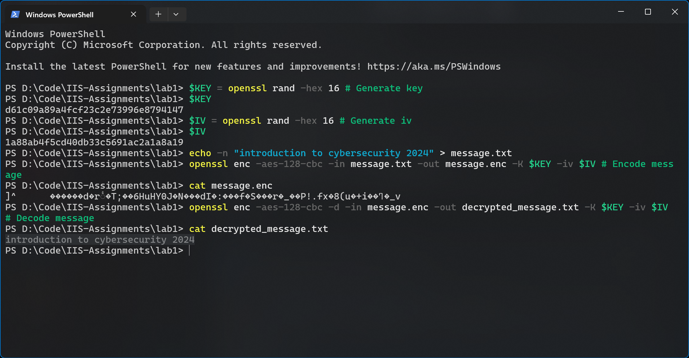
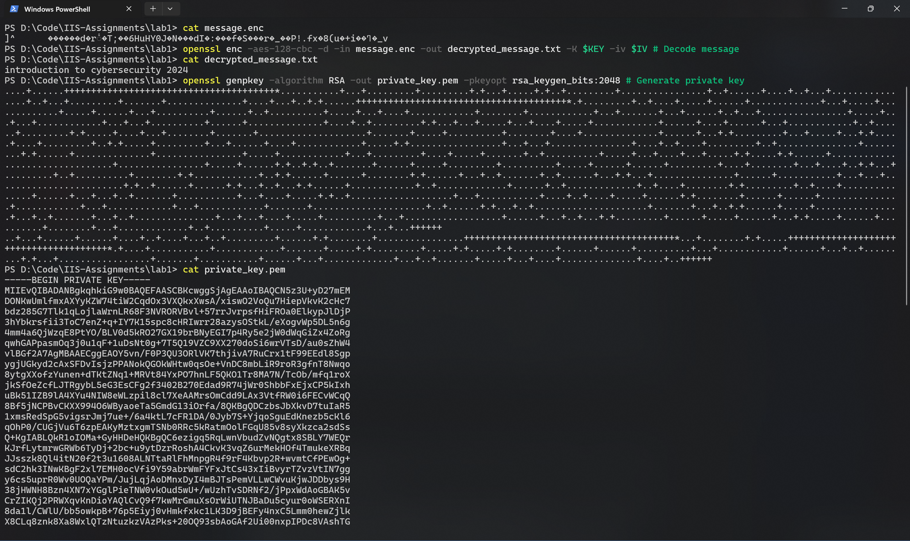
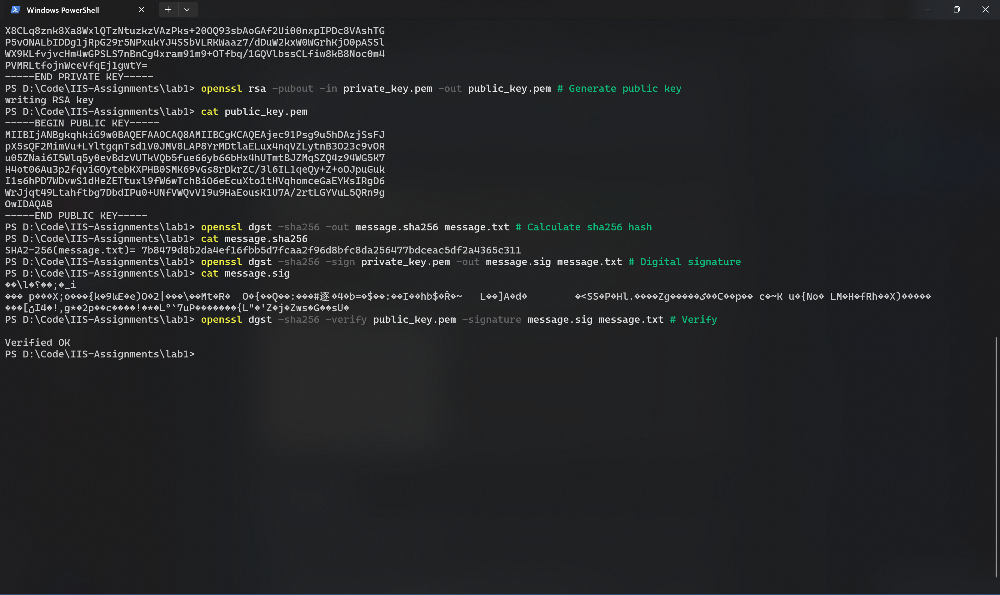

# Lab 1

## 1 (5 points)

> What are the risks of having the US government select a cryptosystem for widespread commercial use (both inside and outside the United States). How could users from outside the United States overcome some or all of these risks

## 2 (5 points)

> Why do we need modes of operation for block ciphers? Also, Give a direct comparison between CBC and CTR.

## 3 (20 points)

> Explain why hash collisions occur. That is, why must there always be two different plaintexts that have the same hash value? What property of a hash function means that collisions are not a security problem. That is, why can an attacker not capitalize on collisions and change the underlying plaintext to another form whose value collides with the hash value of the original plaintext?

## 4 (20 points)

### a) (10 points)

> Identify the CAs (including the intermediate and root ones) that have issued the TLS certificate for [https://ustc.edu.cn/](https://ustc.edu.cn/). Then, identify the certificate expiration date. Besides, export the TLS certificate into a PEM file (e.g., through openssl), and calculate its md5 hash and SHA256 hash.

### b) (10 points)

> Similarly, redo the above experiments for [www.12306.cn](https://www.12306.cn/) and [www.bing.com](https://www.bing.com/).

## 5 (30 points)

> Encrypt/Decrypt/Sign through openssl
>
> 1. Generate an AES-128 key with the cipher mode of CBC through openssl.
> 2. encrypt a message m = “introduction to cybersecurity 2024” and decrypt it back using the above AES-128-cbc secrets.
> 3. Generate a public and private key pair.
> 4. Generate a sha256 hash of the message m, and generate a signature by encrypting the hash with your private key.
> 5. Verify the digital signature, with your public key.
> 6. Take **screenshots** of step 1-5, and embed them in the submission pdf.

Step 1 & 2:

```powershell
$KEY = openssl rand -hex 16 # Generate key
$KEY
$IV = openssl rand -hex 16 # Generate iv
$IV
echo -n "introduction to cybersecurity 2024" > message.txt
openssl enc -aes-128-cbc -in message.txt -out message.enc -K $KEY -iv $IV # Encode message
cat message.enc
openssl enc -aes-128-cbc -d -in message.enc -out decrypted_message.txt -K $KEY -iv $IV # Decode message
cat decrypted_message.txt
```



Step 3~5:

```powershell
openssl genpkey -algorithm RSA -out private_key.pem -pkeyopt rsa_keygen_bits:2048 # Generate private key
cat private_key.pem
openssl rsa -pubout -in private_key.pem -out public_key.pem # Generate public key
cat public_key.pem
openssl dgst -sha256 -out message.sha256 message.txt # Calculate sha256 hash
cat message.sha256
openssl dgst -sha256 -sign private_key.pem -out message.sig message.txt # Digital signature
cat message.sig
openssl dgst -sha256 -verify public_key.pem -signature message.sig message.txt # Verify
```





## 6 (20 points)

> Select and read one of the following papers, summarize its ideas, and give your critical reviews (e.g., pros and cons of this paper):
>
> 1. Diffie, Whitfield, and Martin E. Hellman. "New directions in cryptography." In Democratizing Cryptography: The Work of Whitfield Diffie and Martin Hellman
> 2. ElGamal, Taher. "A public key cryptosystem and a signature scheme based on discrete logarithms." IEEE transactions on information theory 31, no. 4 (1985)
> 3. Troncoso, Carmela, et al. "Decentralized privacy-preserving proximity tracing." arXiv preprint arXiv:2005.12273 (2020).
> 4. Albrecht, Martin R., et al. "Practically-exploitable cryptographic vulnerabilities in matrix." 2023 IEEE Symposium on Security and Privacy (SP). IEEE, 2023.
>
> Your review should contain the following elements:
> 
> 1. A good summary of the paper with one or two paragraphs.
> 2. Key contributions of the paper in terms of identifying new questions, proposing new methodologies, and distilling insightful understandings, etc.
> 3. Limitations and future works
